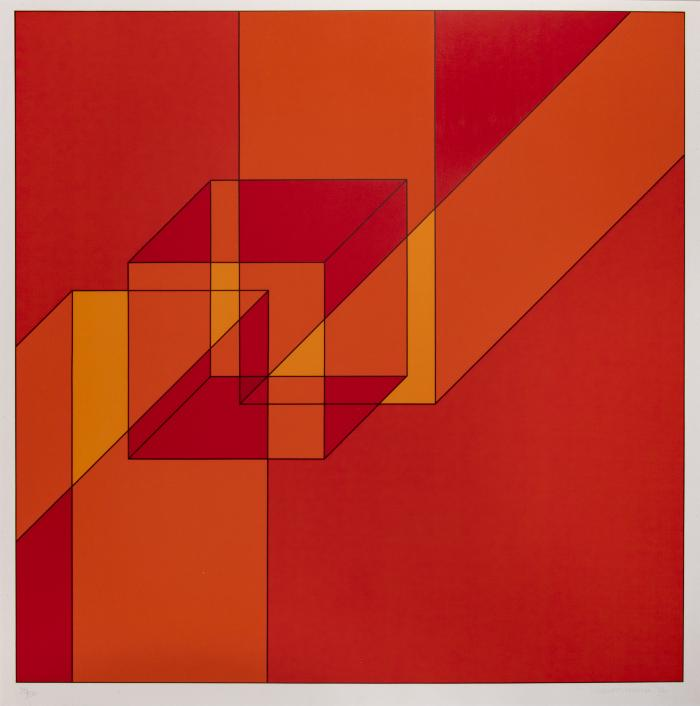

# Art Critic

Using gpt-4o-mini, describes an image and returns the result as JSON.

## Getting Started

1. Install [asdf](https://asdf-vm.com/) and the [asdf Python plugin](https://github.com/asdf-community/asdf-python)

    ```sh
    brew install asdf
    asdf plugin-add python
    asdf install
    ```

1. Install [direnv](https://direnv.net/)

    ```sh
    brew install direnv
    ```

1. Copy the `.envrc.example` to `.envrc` which is outside version control. Add your `OPENAI_API_KEY` to `.envrc` and run `direnv allow`

    ```sh
    cp .envrc.example .envrc
    ```

1. Install the project dependencies

    ```sh
    make deps
    ```

1. Run the main program

    ```sh
    ./main --object-id 113
    ```


## Demo

Given images in `data/images` keyed by their ID, the output is saved to a corresponding `output/{object_id}.json` file.

The prompt is as follows:

> Describe this artwork. Return result as a JSON object with keys equal to style, subjects, color, themes. The value of each key is a list of string keywords.

**Input**

<figure>
  
  <figcaption>Ven B 39 H, Copyright 2025 GVSU</figcaption>
</figure>

**Output**

```jsonc
// Object ID 113
{
  "style": [
    "Geometric",
    "Abstract",
    "Minimalist"
  ],
  "subjects": [
    "Shapes",
    "Lines",
    "Forms"
  ],
  "color": [
    "Red",
    "Orange",
    "Yellow"
  ],
  "themes": [
    "Movement",
    "Contrast",
    "Structure"
  ]
}
```
